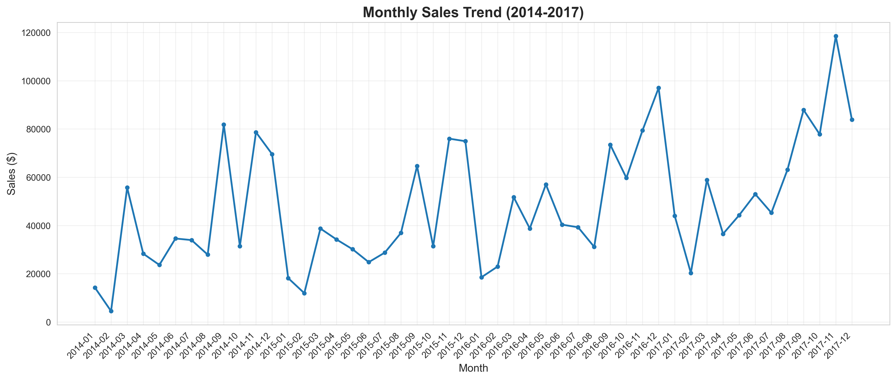
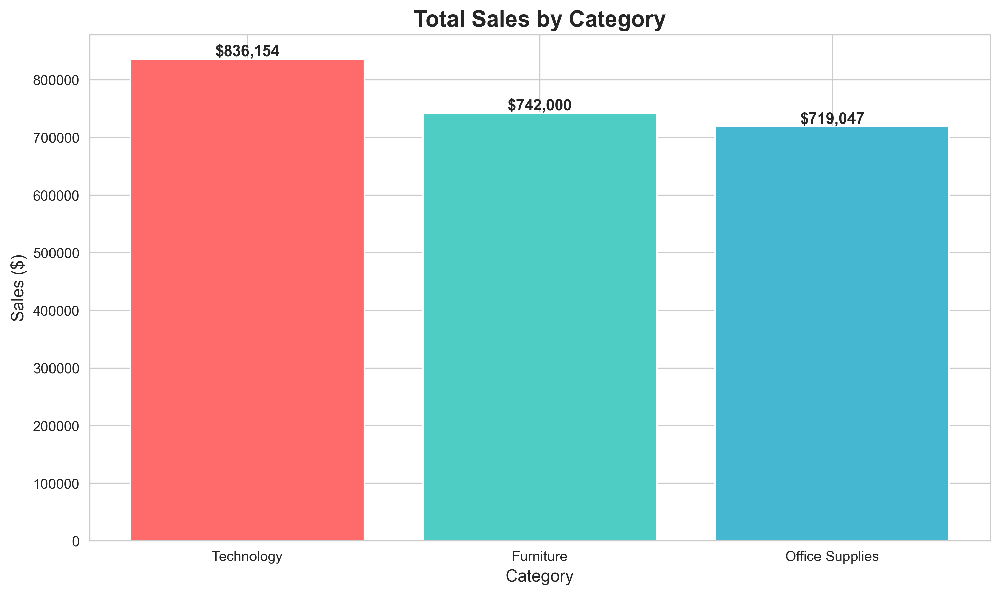
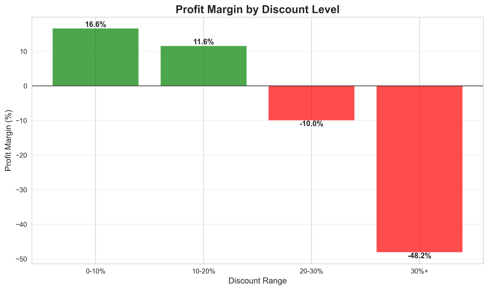
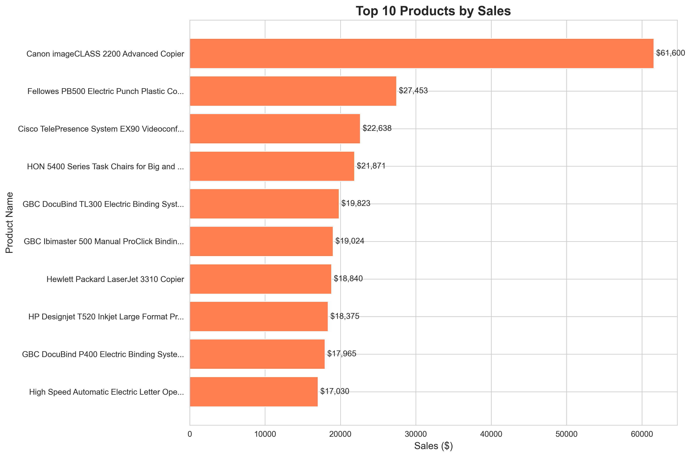

# Retail Sales Analysis & Customer Segmentation

A comprehensive data science project analyzing retail sales data and performing customer segmentation using machine learning techniques.

## Project Overview

This project analyzes 10,000+ retail transactions worth $2.3M in revenue to uncover business insights and segment customers into actionable groups using K-Means clustering algorithm.

## Visualizations

  ### Monthly Sales Trend

### Sales by Category

### Regional Sales

### Discount Impact

### Customer Segmentation

### Top Products

## Key Features

- Exploratory Data Analysis (EDA) on 9,994 transactions
- RFM Analysis for 793 customers
- K-Means Clustering for customer segmentation
- Interactive Visualizations
- Business recommendations

## Technologies Used

- Python, Pandas, NumPy, Scikit-learn
- Matplotlib, Seaborn, Plotly
- Jupyter Notebook

## Author

Devi Senthil Kumar
- GitHub: @devisenthilkumar26
